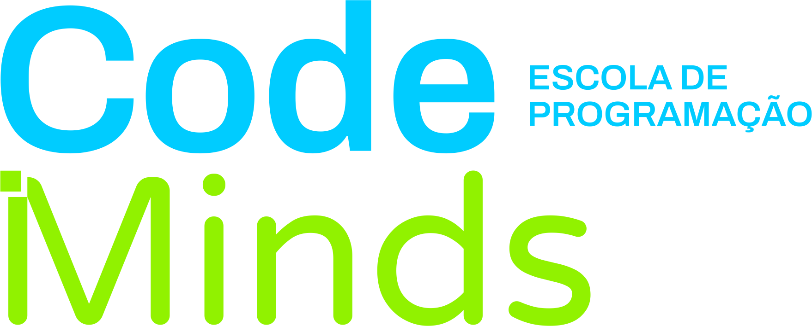
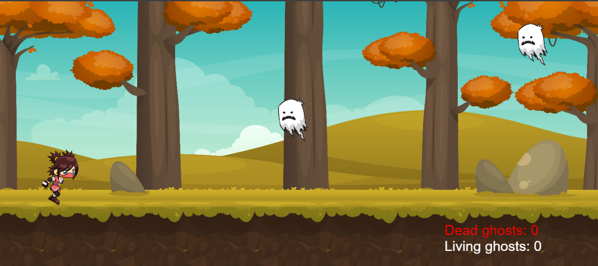

  

---
# Ninja Ghost Blaster

  

## Descrição

**Ninja Ghost Blaster** é um jogo interativo onde um ninja enfrenta fantasmas aterrorizantes em uma jornada para salvar seu mundo. O ninja pode correr, pular e atirar para eliminar os fantasmas que aparecem aleatoriamente. O objetivo é acumular a maior pontuação possível, destruindo os fantasmas e evitando ser tocado por eles.

## Funcionalidades

- **Movimentação do Ninja:** O ninja pode correr, pular e atirar.
- **Animações:** Animações para idle, corrida, pulo e morte do ninja.
- **Obstáculos:** Fantasmas aparecem e se movem na tela.
- **Sistema de Pontuação:** A pontuação aumenta a cada fantasma destruído.
- **Música e Sons:** Efeitos sonoros para ações do ninja e eventos do jogo.
- **Tela de Game Over:** Exibição de tela de game over e opção de reinício.

## Como Jogar

1. **Movimentar:** Use a tecla `RIGHT` para iniciar a corrida.
2. **Pular:** Pressione a tecla `SPACE` para pular.
3. **Atirar:** Pressione a tecla `LEFT` para atirar.

## Tecnologias Usadas

- **p5.js:** Biblioteca JavaScript para criação gráfica e interatividade.
- **VSCode:** Editor de código usado para o desenvolvimento.
- **JavaScript:** Linguagem de programação principal.

## Créditos

- **Desenvolvimento:** Este jogo foi desenvolvido pela **Code Minds** e pela **professora Carla Vasconcelos** como parte de um projeto educacional. Carla Vasconcelos, co-fundadora da Code Minds, criou este jogo para ser usado como fonte de estudo e inspiração. Confira o GitHub da professora Carla Vasconcelos em [https://github.com/VasconcelosCarla](https://github.com/VasconcelosCarla).
- **Imagens dos Ninjas:** [GameArt2D](https://www.gameart2d.com/freebies.html)
- **Imagens dos Fantasmas:** [Bevouliin](https://bevouliin.com/spooky-ghost-sprites-free-game-asset/)
- **Plano de Fundo:** [NoHat](https://nohat.cc/f/autumn-landscape-background/4517330503598080-201809020817.html)
- **Sons:** Obtidos de plataformas de áudio gratuito, usados para fins acadêmicos.

## Contribuição

Se você deseja contribuir para o desenvolvimento do jogo ou fazer alterações, por favor, faça um fork deste repositório e envie um pull request com suas melhorias. Todas as contribuições são bem-vindas!

## Licença

Este projeto foi criado pela Code Minds e pela professora Carla Vasconcelos para ser utilizado como material de estudo e inspiração. Agradecemos a sua compreensão e apoio.

---

**Code Minds**  
Desenvolvido para fins educacionais e para inspirar novos desenvolvedores. Siga-nos no [GitHub](https://github.com/EscolaCodeMinds) e no [Instagram](https://www.instagram.com/escolacodeminds?igsh=MWZpd2JucWtxY3ZyOA==) para mais projetos e recursos!
